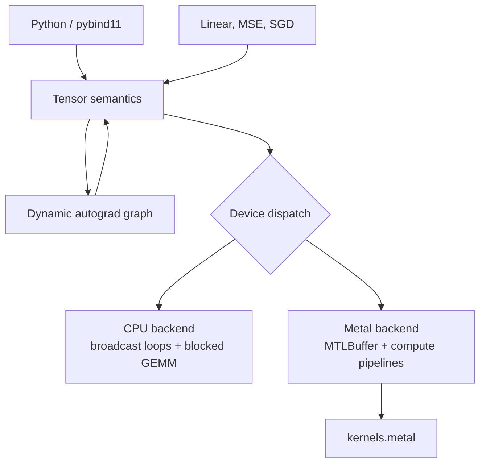

# VectorCore

VectorCore is a from-scratch C++20 tensor and reverse-mode automatic-differentiation runtime. It has a native CPU backend, a real Apple Metal compute backend, Python bindings through pybind11, neural-network training examples, numerical tests against NumPy and PyTorch, and reproducible benchmarks.

The core does **not** call NumPy, PyTorch, Eigen, or another tensor library. NumPy and PyTorch appear only in Python tests and benchmarks as references.

## What works

- float32 scalar, vector, matrix, and higher-rank tensors
- checked shapes, contiguous strides, indexing, reshape/flatten views, and 2-D transpose
- stride-based NumPy-style broadcasting without expanded operand copies
- add, subtract, multiply, divide, negate, sum, mean, ReLU, sigmoid, and rank-2 matrix multiplication
- dynamic computation graphs and reverse-mode gradients for every operation above
- broadcast-gradient reduction, branched-graph accumulation, repeated backward accumulation, and CPU/Metal transfers in the graph
- blocked, multithreaded CPU matrix multiplication
- real Metal buffers and shaders for broadcast elementwise operations, activations, transpose, tree reduction, broadcast-gradient reduction, and tiled matrix multiplication
- Python `Tensor`, `Linear`, MSE loss, and SGD interfaces
- deterministic linear-regression and two-layer-network training examples

## Architecture



`Tensor` is a small shared handle to `TensorImpl`. The implementation owns a `shared_ptr<Storage>`, shape, strides, dtype, device-derived storage identity, and optional autograd metadata. Reshape creates a shared-storage view; ordinary operation results own contiguous storage. Graph nodes strongly own their parents but parents never own children, so graph lifetimes are acyclic. CPU storage is a `std::vector<float>`; Metal storage RAII-owns an `id<MTLBuffer>` under ARC.

See [architecture.md](docs/architecture.md) for the detailed execution and ownership design.

## Build

Requirements are macOS or Linux with a C++20 compiler and Python 3.9+. Apple Metal is enabled only on macOS. The provided setup uses a local `.venv`; it does not alter the system Python.

```bash
make setup
make build
make test
```

On Apple Silicon, shaders are embedded from `metal/kernels.metal` at build time and compiled into actual Metal compute pipelines when the backend initializes. A missing or failed Metal device/compiler is reported by `metal_available()` and `last_error()`; operations never silently fall back to CPU. On non-Apple platforms the explicit stub backend reports Metal as unavailable while the CPU runtime remains buildable.

Direct CMake use is also supported:

```bash
cmake -S . -B build -DCMAKE_BUILD_TYPE=Release \
  -Dpybind11_DIR="$(python -m pybind11 --cmakedir)"
cmake --build build --parallel
ctest --test-dir build --output-on-failure
```

## C++ example

```cpp
#include <vectorcore/vectorcore.hpp>
using namespace vectorcore;

Tensor x({1, 2, 3, 4}, {2, 2}, true);
Tensor w({0.5F, -1.0F, 1.5F, 2.0F}, {2, 2}, true);
Tensor loss = x.matmul(w).relu().mean();
loss.backward();
auto dw = w.grad();
```

## Python example

The extension is emitted into `build/`, so use `PYTHONPATH=build` from a source checkout.

```python
import vectorcore as vc

a = vc.Tensor([[1, 2], [3, 4]], requires_grad=True)
b = vc.Tensor([[5, 6], [7, 8]], requires_grad=True)
loss = (a @ b).sum()
loss.backward()
print(a.grad.numpy())
```

Run both training examples with:

```bash
make example
```

The checked run converged linear regression from loss `1.99738` to `6.32e-14` and learned weight `2`, bias `1`. The two-layer example reduced loss from `0.246688` to `0.005123` in 400 SGD steps.

## Tests

`make test` builds and runs both suites. Coverage includes shape errors, scalar and multi-axis broadcasting, invalid broadcast/device/matmul cases, storage sharing, empty reductions, elementwise operations, non-square matmul, activations, graph branching, repeated-backward accumulation, broadcast-gradient reduction, analytical gradients, finite differences, an exact PyTorch gradient comparison, end-to-end training, Metal kernels, CPU/GPU parity, and Metal autograd.

The final validated run on an Apple M4 passed:

- C++: 15/15 cases
- Python: 8/8 cases
- ASan + UBSan C++ run: 15/15 cases (macOS does not provide ASan leak detection)

## Benchmarks

```bash
make benchmark                         # 128, 256, 512
PYTHONPATH=build .venv/bin/python benchmarks/benchmark.py --full --repeats 5
```

Inputs are created before timing; each operation receives two warmups; the median of repeated wall-clock samples is reported; GPU work is synchronized; transfers are measured separately. The table below is a subset of an actual 2026-10-02 run on an Apple M4 with 16 GB RAM, NumPy 2.0.2, and PyTorch 2.8.0. Times are milliseconds and include output allocation and dispatch but exclude input creation and CPU/GPU transfer.

| Size | Backend | add | multiply | matmul |
|---:|---|---:|---:|---:|
| 128 | NumPy | 0.003 | 0.004 | 0.012 |
| 128 | VectorCore CPU | 0.071 | 0.084 | 0.349 |
| 128 | VectorCore Metal | 0.641 | 0.675 | 0.551 |
| 128 | PyTorch CPU | 0.006 | 0.005 | 0.012 |
| 128 | PyTorch MPS | 0.894 | 0.312 | 0.384 |
| 512 | NumPy | 0.050 | 0.050 | 0.419 |
| 512 | VectorCore CPU | 1.319 | 1.405 | 9.547 |
| 512 | VectorCore Metal | 0.368 | 0.379 | 3.152 |
| 512 | PyTorch CPU | 0.067 | 0.066 | 0.392 |
| 512 | PyTorch MPS | 0.647 | 0.408 | 0.634 |
| 2048 | NumPy | 1.367 | 0.970 | 30.101 |
| 2048 | VectorCore CPU | 18.786 | 21.517 | 849.880 |
| 2048 | VectorCore Metal | 6.626 | 5.485 | 87.273 |
| 2048 | PyTorch CPU | 1.495 | 1.744 | 22.814 |
| 2048 | PyTorch MPS | 1.498 | 1.413 | 10.930 |

VectorCore is not faster than optimized vendor libraries. Its scalar broadcast index calculation limits CPU elementwise throughput, its home-grown GEMM lacks AMX/BLAS-class packing and microkernels, and the synchronous Metal design pays a command-buffer boundary per operation. The Metal backend becomes worthwhile relative to VectorCore CPU for larger work, but PyTorch MPS remains substantially faster at large GEMM. Full results and interpretation are in [benchmarks.md](docs/benchmarks.md).

## Known limitations

- float32 is the only dtype.
- matrix multiplication and transpose are rank-2; batched GEMM is not implemented.
- reductions currently reduce all elements rather than accepting axes.
- all operation outputs are contiguous; only reshape is a shared-storage view.
- Metal calls are synchronous, without command fusion, allocator pooling, or asynchronous streams.
- Metal broadcast-gradient reduction favors portability and correctness over speed (one thread per target element).
- SGD mutation is CPU-only; Metal forward/backward works, but an optimizer step requires an explicit CPU transfer.
- graphs are retained as long as output tensors reference them; there is no `retain_graph`/early-release API.

These constraints are explicit—the runtime does not claim unsupported kernels ran on the GPU.

## Repository map

```text
include/vectorcore/   public API and internal TensorImpl definition
src/cpu/              CPU kernels
src/metal/            Metal resource/dispatch implementation and non-Apple stub
metal/                Metal Shading Language kernels
python/               pybind11 bindings
tests/                C++ and Python numerical/integration tests
benchmarks/           C++ smoke benchmark and cross-framework Python harness
examples/             linear regression and two-layer network
docs/                 design and measured benchmark notes
```

Private study documents are deliberately excluded by `.gitignore` and are not part of this repository.
